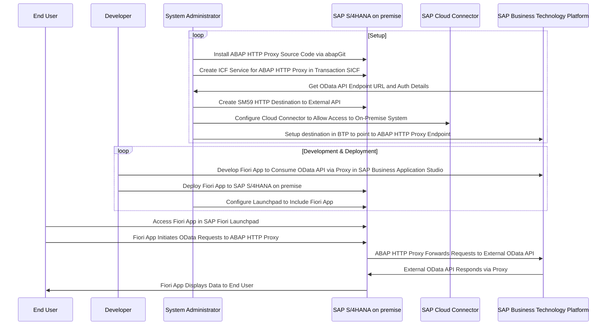

# ABAP HTTP Proxy

This repository contains an ABAP based HTTP proxy service that can be deployed on SAP NetWeaver AS ABAP / SAP ABAP Platform systems. The proxy service allows you to forward HTTP requests from the ABAP environment to external HTTP Endpoints. You can install the proxy using [abapGit](https://docs.abapgit.org/user-guide/projects/online/install.html).

## Use Case

There is an OData API provided in SAP Business Technology Platform (BTP) that you want to consume with an SAPUI5 / Fiori application in your SAP S/4HANA on premise system. The Fiori application should still run directly in the embedded SAP Fiori Launchpad of your SAP S/4HANA on premise system. To allow authentication either with a technical user or using principal propagation, you need this ABAP based HTTP proxy in your SAP S/4HANA or SAP ERP/ECC on premise system. 

## Architecture

The following diagram illustrates the architecture of the solution:

## Alternative Solutions

- UI5/Fiori application hosted on BTP: Integration in the on-premise SAP Fiori Launchpad via Link Tile. Will open the app in a new browser tab.
- UI5/Fiori application on ABAP system using CDS OData service based on data replication from BTP to on-premise system: Implementation of the data replication can be complex, CDS based OData service will be easy.
- UI5/Fiori application on ABAP system using CDS OData service based on direct access to BTP OData service: S/4HANA until 2023 does only support Service Consumption Models for RFC and Web Services.